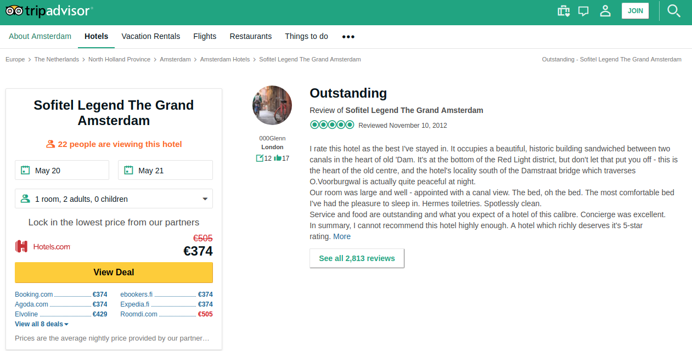
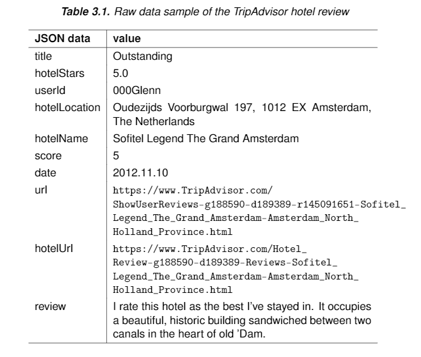
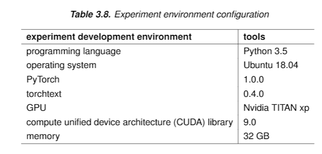
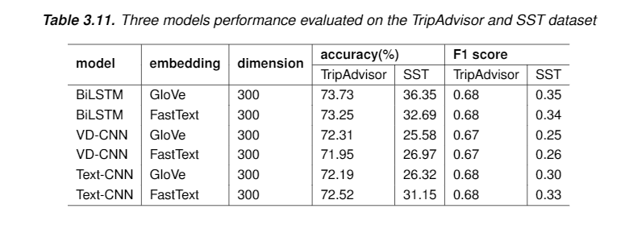

# Thesis - sentiment classification with deep neural networks

## Experiment

### dataset 
1. Stanford Sentiment treebank dataset
2. the own-made TripAdvisor dataset, download link, https://drive.google.com/drive/folders/19TdLOrqjAQ11lpYRx1r2GcYo79fZXloE?usp=sharing 

#### data sample in the TripAdvisor dataset

* the raw data on the TripAdvisor website

* JSON data collected from the web page

### experiment environment

### experiment result

### the pdf report

* Yi_ZHOU_master_thesis_sentiment_classification_with_deep_neural_networks_2019.pdf

### algorithms used in the experiment

[1] Conneau, Alexis, et al. "Very deep convolutional networks for text classification." arXiv preprint arXiv:1606.01781 (2016).  
[2] Kim, Yoon. "Convolutional neural networks for sentence classification." arXiv preprint arXiv:1408.5882 (2014).  
[3] Wang, Xingyou, Weijie Jiang, and Zhiyong Luo. "Combination of convolutional and recurrent neural network for sentiment analysis of short texts." Proceedings of COLING 2016, the 26th International Conference on Computational Linguistics: Technical Papers. 2016.    

<!-- ### clean review data statistics
 
 data source                       |       number    
 ----------------------------------|-----------------
 tripadvisor.com                   |   xxx

## algos
order | algorithms               |  details      | accuracy
------| -------------------------|---------------|------------------- 
1     | VADER                    |  [1]          | 
      |   Machine learning method|               |                         
2     | SVM(LR)                  |  [2]          |                        
      | Deep learning method     |                                      
3     | Word CNN                 |  [5]          |                         
4     | CNN_Text_Model           |  [4]           |                         
5     | BiLSTMConv               |   [3]          |                              
6     | VDCNN                    |   [6]         |                  

## reference

[1] https://github.com/cjhutto/vaderSentiment

[2] Thumbs up? Sentiment Classification using Machine Learning  |https://arxiv.org/pdf/cs/0205070.pdf

[3] tensorflow实现基于LSTM的文本分类方法, 博客链接， https://blog.csdn.net/u010223750/article/details/53334313; https://github.com/luchi007/RNN_Text_Classify,   

[4] Kim, Yoon. "Convolutional neural networks for sentence classification." arXiv preprint arXiv:1408.5882 (2014). 
Implementing a CNN for Text Classification in TensorFlow, http://www.wildml.com/2015/12/implementing-a-cnn-for-text-classification-in-tensorflow/; https://github.com/dennybritz/cnn-text-classification-tf 

[5] Johnson, Rie, and Tong Zhang. "Convolutional neural networks for text categorization: Shallow word-level vs. deep character-level." arXiv preprint arXiv:1609.00718 (2016).

# template project   

1. ToxicCommentClassification-pytorch, https://github.com/keithyin/ToxicCommentClassification-pytorch
2. https://github.com/prakashpandey9/Text-Classification-Pytorch
3. 中国人工智能学会通讯, 优秀博士论文精华版, 文本情感分析中的卷积方法, https://book.yunzhan365.com/poui/iart/mobile/index.html?from=timeline&isappinstalled=0

## 文本情感分类用的模型,paper如下
1. attention+RNN做文本情感分类《Recurrent Attention Network on Memory for Aspect Sentiment Analysis》
2. DPCNN做文本分类《Deep Pyramid Convolutional Neural Networks for Text Categorization》
3. CNN做文本分类《Effective Use of Word Order for Text Categorization with Convolutional Neural Networks》

[6] Conneau, Alexis, et al. "Very deep convolutional networks for text classification." arXiv preprint arXiv:1606.01781 (2016). https://github.com/threelittlemonkeys/vdcnn-pytorch, https://github.com/ArdalanM/nlp-benchmarks

[7] https://github.com/brightmart/text_classification, all kinds of text classification models and more with deep learning

[8] Zhou, Chunting et al. “A C-LSTM Neural Network for Text Classification.” CoRR abs/1511.08630 (2015): n. pag., https://www.semanticscholar.org/paper/A-C-LSTM-Neural-Network-for-Text-Classification-Zhou-Sun/10f62af29c3fc5e2572baddca559ffbfd6be8787
 -->
